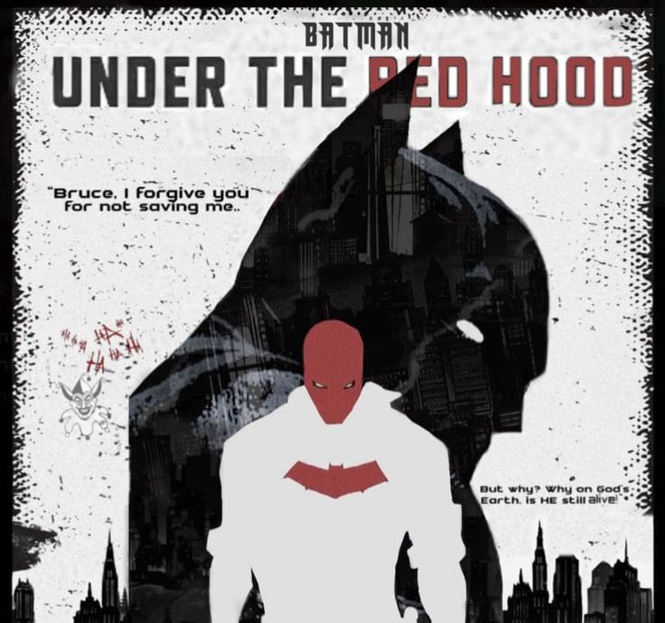

# Selvaragavan M — Portfolio (Red Hood Theme)

Single-page portfolio site. Vanilla HTML/CSS/JS, zero build step. Deploy as-is to Vercel, GitHub Pages, or Hugging Face Spaces.

## Folder structure

```
redhood-portfolio/
├── index.html          ← the entire site (open this)
├── README.md            ← this file
└── assets/
    ├── resume.pdf        ← YOU ADD THIS
    ├── hero-portrait.jpg  ← YOU ADD THIS (optional but recommended)
    └── projects/
        ├── armurai.mp4         ← YOU ADD THIS
        ├── gnn-malware.mp4     ← YOU ADD THIS
        ├── mlops-incident.mp4  ← YOU ADD THIS
        ├── truck-parking.mp4   ← YOU ADD THIS
        ├── policylens.mp4      ← YOU ADD THIS
        └── zkbot.mp4           ← YOU ADD THIS
```

## Asset checklist — exactly what to supply

| Asset | Ideal size | Format | Required? |
|---|---|---|---|
| `assets/resume.pdf` | — | PDF | Yes — nav "Resume" button links here |
| `assets/hero-portrait.jpg` | 900×1100px (portrait, 4:5) | JPG/WEBP, under 300KB | Optional — hero currently shows a placeholder card |
| `assets/projects/*.mp4` (×6) | 1280×800px, 16:10, 5–15s loop | MP4 (H.264), under 3–5MB each | Optional — cards currently show placeholder text |

Videos autoplay muted/looped inside the project cards, so keep them short, silent-safe, and loopable (no jump-cut at the seam). Keep each file small — six autoplaying videos on one page adds up fast on mobile data.

## Where each asset plugs in (exact places to edit in `index.html`)

### 1. Resume PDF
Search for `assets/resume.pdf` (appears twice: desktop nav button, mobile nav button). Just drop your file at `assets/resume.pdf` and the links work immediately — no HTML edit needed if you use that exact filename/path.

### 2. Hero portrait
Find this block (search `hero-frame`):
```html
<div class="hero-frame" id="heroFrame">
  <div class="project-media-placeholder" style="position:relative;aspect-ratio:4/5;">
    <i data-lucide="image" width="30" height="30"></i>
    <span>Add portrait: assets/hero-portrait.jpg (900×1100)</span>
  </div>
</div>
```
Replace the inner `<div class="project-media-placeholder">...</div>` with:
```html

```
The tilt/parallax effect is already wired to `#heroFrame` — no JS changes needed.

### 3. Project videos (6 cards)
Each project card has a `.project-media` block with an HTML comment telling you the exact filename it expects and a placeholder `<div>` beneath it. Search for `project-media-placeholder` — you'll find six of them, one per project, each showing its expected path:

- `assets/projects/armurai.mp4`
- `assets/projects/gnn-malware.mp4`
- `assets/projects/mlops-incident.mp4`
- `assets/projects/truck-parking.mp4`
- `assets/projects/policylens.mp4`
- `assets/projects/zkbot.mp4`

For each one, replace:
```html
<div class="project-media-placeholder"><i data-lucide="film" width="26" height="26"></i><span>assets/projects/armurai.mp4 (1280×800)</span></div>
```
with:
```html
<video src="assets/projects/armurai.mp4" autoplay muted loop playsinline></video>
```
(swap the filename per card). Do this inside **both** places that reference the same project — the card in the main grid — the modal pulls the video automatically via JS (it clones whatever HTML is inside `.project-media`), so you only need to edit each card once.

## Everything else is already wired up

- **Project filter tabs** (All / AI & ML / Cybersecurity / Robotics) — working, no setup needed.
- **"View Details" modal** — pulls title, full description, badges, tech chips, links, and media straight from each card's data automatically.
- **Theme toggle** (dark Red Hood / "daylight Gotham" light mode) — top-right nav icon.
- **Custom cursor, preloader, scroll-reveal animations, stat counters, timeline draw-in, tilt on cards, searchlight beam, neural particle field, city skyline** — all built in, respect `prefers-reduced-motion`, and disable the custom cursor automatically on touch devices.
- **Contact info, social links, certifications (Drive folder), achievements, timeline, education** — already filled with your real data from the brief.

## Deploying

Any static host works with zero config:

- **Vercel**: drag the `redhood-portfolio` folder into the Vercel dashboard, or `vercel deploy` from inside it. No `vercel.json` needed.
- **GitHub Pages**: push this folder to a repo, enable Pages on the `main` branch root (or `/docs`), done.
- **Hugging Face Spaces**: create a Static Space, upload these files, done.

## Notes on what changed from your draft brief

- Recolored from the original gold/cyan draft to a **Red Hood palette**: blood-red (`#c81d25`) primary, hot ember red (`#ff4034`) for hover/active states, gunmetal steel (`#8b93a0`) as the secondary/tech accent, bone white (`#e8e2d8`) for highlights, and a rare warning amber (`#f0b23a`) reserved only for the Achievements section.
- Removed the "Pentesting Chatbot — RAG + CAG" project card and replaced it with **Smart Truck Parking Management System** (FastAPI + Next.js, gatekeeper workflows, automated billing, WhatsApp notifications, admin dashboards) — no GitHub link was supplied for this one, so the card ships without a GitHub button (only "View Details"). Add a link inside its `.project-links` block if you get a repo up.
- All project images were converted to **video-first placeholders** (`<div class="project-media-placeholder">`) sized for MP4 loops per your note that you'll supply video, not static images.
